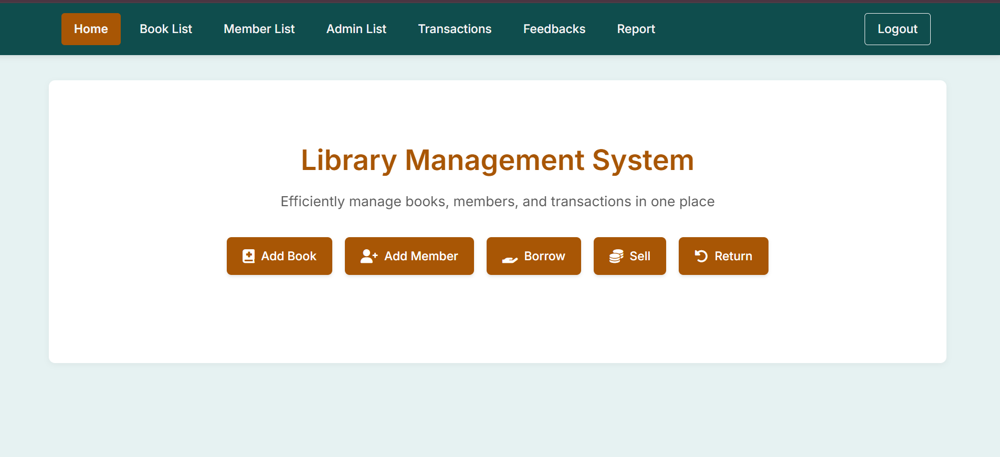
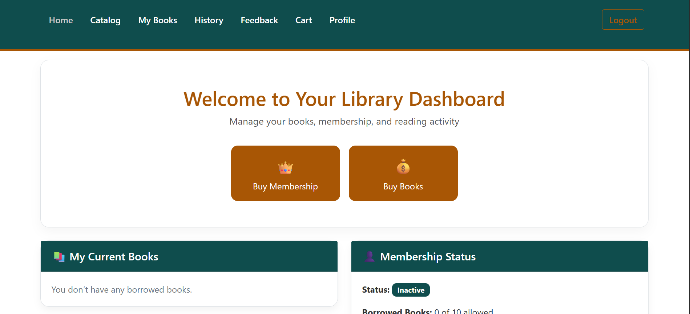
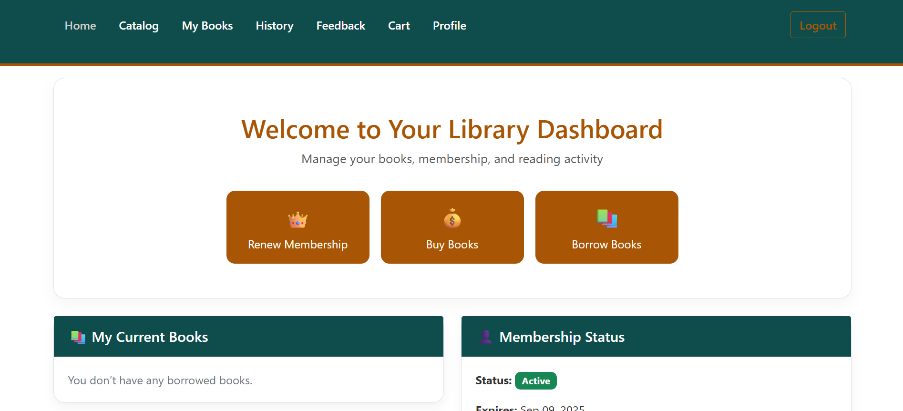
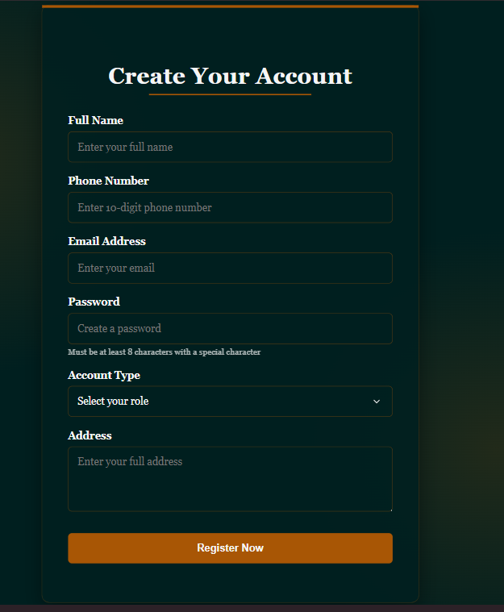

## 📚 Library Management System (Flask + SQLite + Tailwind CSS)

A modern Library Management System built using **Flask**, **SQLite**, **Python**, **JavaScript**, and **Tailwind CSS**. The system supports **user membership purchases**, **book borrowing and buying**, and **admin-level management** of users, books, and borrowing data.

---

## 🔑 Key Features

### 🧑‍💼 User Roles

* **Admin**

  * Create and manage other admins.
  * Create and manage users.
  * Add, update, or remove books.
  * View full borrowing and purchasing history of all users.
* **User (Non-Member)**

  * Can register for an account.
  * Must **purchase a membership** to borrow books.
  * Can buy books anytime.
* **Member (Paid User)**

  * Can **borrow books for free**.
  * Can also **buy books**.
  * Can view their own **borrow and purchase history**.

---

### 📗 Book Management

* **Admin** can:

  * Add new books manually.
  * Fetch book data from the **Frappe Books API**.
  * Update book details (title, author, genre, quantity).
  * Remove books from the system.
* **Users** can:

  * Search for books by title, author, or genre.
  * See **availability** status and quantity.

---

### 👥 Borrower Management

* Admin can:

  * View all registered users.
  * Add new users manually (optional).
  * Promote users to admins.

---

### 🔄 Borrowing and Buying

* **Borrowing (Members only)**:

  * Link book to user via membership ID.
  * Record borrow and **auto-calculate due date**.
  * Log returns and check for overdue status.
* **Buying (All users)**:

  * Add books to cart and purchase.
  * Store purchase records in user history.

---

### 💳 Membership System

* New users must **purchase a membership** to borrow books.
* Membership is stored in the user’s profile.
* Admins can toggle membership status manually (if needed).

---

### 💰 Fine Calculation (Optional/Pluggable)

* Automatically apply **late return fines** based on due dates.
* Display outstanding fines in user and admin dashboards.

---

Great! Here's the updated version of your **Library Management System** description with the new requirement included:

> When a user returns a book, they will be given a **return date**, and the **admin is notified via email** to pick up the returned book.

---

## 📚 Library Management System (Flask + SQLite + Tailwind CSS)

A modern Library Management System built using **Flask**, **SQLite**, **Python**, **JavaScript**, and **Tailwind CSS**. The system supports **user membership purchases**, **book borrowing and buying**, and **admin-level management** of users, books, and borrowing data.

---

## 🔑 Key Features

### 🧑‍💼 User Roles

* **Admin**

  * Create and manage other admins.
  * Create and manage users.
  * Add, update, or remove books.
  * View full borrowing and purchasing history of all users.
  * Receive email notifications for book return pickups.
* **User (Non-Member)**

  * Can register for an account.
  * Must **purchase a membership** to borrow books.
  * Can buy books anytime.
* **Member (Paid User)**

  * Can **borrow books for free**.
  * Can also **buy books**.
  * Can view their own **borrow and purchase history**.

---

### 📗 Book Management

* **Admin** can:

  * Add new books manually.
  * Fetch book data from the **Frappe Books API**.
  * Update book details (title, author, genre, quantity).
  * Remove books from the system.
* **Users** can:

  * Search for books by title, author, or genre.
  * See **availability** status and quantity.

---

### 👥 Borrower Management

* Admin can:

  * View all registered users.
  * Add new users manually (optional).
  * Promote users to admins.

---

### 🔄 Borrowing and Buying

* **Borrowing (Members only)**:

  * Link book to user via membership ID.
  * Record borrow and **auto-calculate due date**.
  * Log returns and check for overdue status.
  * Upon return, user is given a **return date**.
  * **Admin receives an email notification** with the return details to **pick up the book**.
* **Buying (All users)**:

  * Add books to cart and purchase.
  * Store purchase records in user history.

---

### 💳 Membership System

* New users must **purchase a membership** to borrow books.
* Membership is stored in the user’s profile.
* Admins can toggle membership status manually (if needed).

---

### 💰 Fine Calculation (Optional/Pluggable)

* Automatically apply **late return fines** based on due dates.
* Display outstanding fines in user and admin dashboards.

---

### 📊 Reporting & Dashboards

* **User Dashboard**:

  * View current borrowed books.
  * View purchase and borrow history.
  * See membership status.
* **Admin Dashboard**:

  * View system-wide stats: most borrowed books, active users, overdue books.
  * View all transactions and reports.
  * Manage all users and books.

---

## 📬 Email Notification Workflow

* When a user returns a book:

  1. A **return date** is recorded.
  2. The system triggers an **email to the admin** with:

     * Book title and ID.
     * Borrower name and membership ID.
     * Scheduled return date and time.
  3. The admin is expected to **pick up the book** as per the return schedule.

---

## 🛠 Technologies Used

| Technology       | Purpose                                  |
|------------------| ---------------------------------------- |
| **Flask**        | Backend web framework (Python)           |
| **SQLite**       | Lightweight local relational database    |
| **Tailwind CSS** | Utility-first CSS for UI design          |
| **JavaScript**   | Front-end interactivity                  |
| **Frappe API**   | External source for book data (optional) |
| **SMTP**   | For sending return notification emails                 |


## 📚 Admin View


## 📚 User View


## 📚 Member View


## 📚 To Register



---

## 🚀 Getting Started

Follow these steps to run the Library Management System locally on your machine:

### ✅ Requirements

Make sure Python 3.7+ is installed on your machine.

### 📦 Install Dependencies

```bash
$ pip install -r requirements.txt
```

### ⚙️ Set Environment Variables

For development mode and proper Flask app initialization, run:

**Linux/macOS:**

```bash
$ export FLASK_APP=app.py
$ export FLASK_ENV=development
```

**Windows (CMD):**

```cmd
> set FLASK_APP=app.py
> set FLASK_ENV=development
```

**Windows (PowerShell):**

```powershell
$env:FLASK_APP = "app.py"
$env:FLASK_ENV = "development"
```

### ▶️ Start the Server

```bash
$ flask run
```

### 🔁 Or Run This Alternative Command

```bash
$ python -m flask run
```

---


